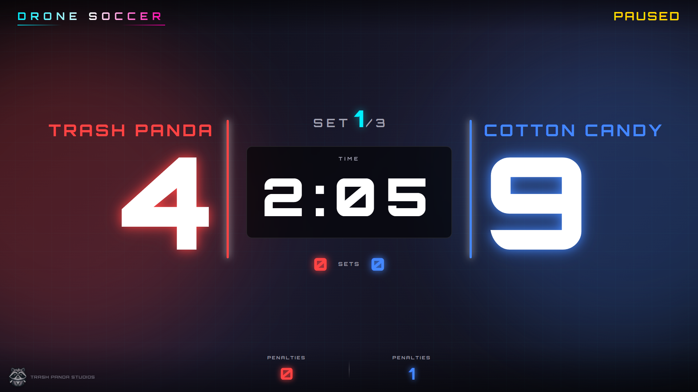
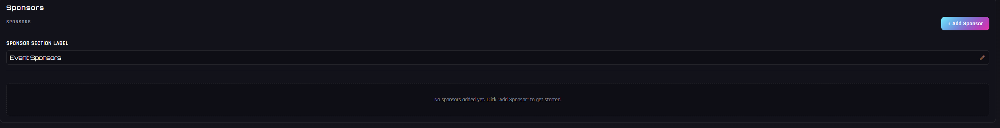
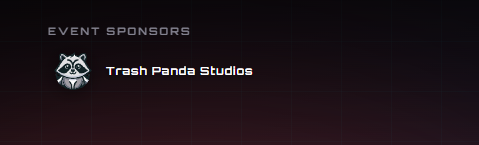

# Drone Soccer Scoreboard

An official scoreboard application for Drone Soccer following FAI rules. Built with Electron and React for a portable, offline experience with multi-monitor support.




## Features

- **Dual Window Display** - Scoreboard display for spectators and Referee control panel
- **Multi-Monitor Support** - Automatically places scoreboard on secondary display
- **FAI Rules Compliant** - Support for standard match formats and penalty phases
- **Sets & Rounds Management** - Track multiple sets per match with history editing
- **Penalty Phase** - Dedicated interface for tie-breaker penalty shootouts
- **Sponsor Management** - Display rotating or static sponsor logos on the scoreboard
- **Configurable Timer** - Quick presets (1, 2, 3, 5 min) or custom time for matches and breaks
- **Score & Penalty Tracking** - Easy increment/decrement controls with keyboard shortcuts
- **Automatic Match Results** - Saves match data to JSON for every round and final result
- **Team Customization** - Editable team names and colors
- **Sound Effects** - Match end buzzer and automated alerts
- **Offline Capable** - No internet required, fully portable

## Getting Started

### Downloading the App

1. Go to the [Releases](https://github.com/TrashPandaStudios/ds-scoreboard/releases) page on GitHub.
2. Look for the **latest release** (at the top of the page).
3. Scroll down to the **"Assets"** section of that release (you may need to click it to expand).
4. Download the file corresponding to your operating system:
   - **Windows**: `Drone.Soccer.Scoreboard.exe` (Portable)

### Running the Application

Once downloaded, simply run the executable. No installation is required for the portable version.

1. **Launch**: Double-click the file to start.
2. **Display Setup**: 
   - Ensure your secondary monitor (projector/TV) is connected before launching.
   - The **Scoreboard** window will automatically attempt to open on the secondary display.
   - The **Referee Control Panel** will open on your primary display.
3. **Usage**: Follow the [Referee Controls](#referee-controls) and [Keyboard Shortcuts](#keyboard-shortcuts) sections below to manage the match.

## Developer Quick Start

### Prerequisites

- Node.js 18+ installed
- npm or yarn package manager

### Installation

```bash
# Clone or download the project
cd DroneSoccerScoreboard

# Install dependencies
npm install

# Start in development mode
npm run electron:dev
```

### Building for Distribution

```bash
# Build production app
npm run package
```

The packaged application will be in the `release` folder.

## Usage

### Starting a Match

1. Launch the application - two windows will open:
   - **Scoreboard** (displays on secondary monitor if available)
   - **Referee Control Panel** (displays on primary monitor)

2. Configure team names and colors in the Referee Panel

3. Set match time (default: 3:00) and number of sets

4. Press **Start** to begin the countdown

### Referee Control Panel


The Referee Control Panel allows you to manage every aspect of the match in real-time.

### Referee Controls

| Control | Function |
|---------|----------|
| **+/- Score** | Increment/decrement team scores |
| **+/- Penalties** | Track penalty count per team |
| **Start/Pause** | Control match timer |
| **Reset Timer** | Reset to configured time |
| **End Set** | Conclude the current round and save results |
| **Start Break** | Begin a timed break between sets |
| **Sponsors** | Add, remove, and reorder sponsor logos |
| **🔊/🔇** | Toggle sound effects |

### Sponsor Management




You can add custom sponsor logos that appear on the main scoreboard. logos are automatically synced and resized to fit the display appropriately. Use the "Sponsor Section Label" to customize the title of the sponsor block (e.g., "Our Partners" or "Tournament Sponsors").

### Keyboard Shortcuts

The Referee Panel supports several keyboard shortcuts for rapid control during intense matches:

| Team | Action | Key(s) |
|------|--------|--------|
| **Team 1 (Home)** | Increment Score | <kbd>W</kbd> |
| | Decrement Score | <kbd>S</kbd> |
| | Increment Penalty | <kbd>D</kbd> |
| | Decrement Penalty | <kbd>A</kbd> |
| **Team 2 (Away)** | Increment Score | <kbd>↑</kbd> |
| | Decrement Score | <kbd>↓</kbd> |
| | Increment Penalty | <kbd>→</kbd> |
| | Decrement Penalty | <kbd>←</kbd> |

> [!NOTE]
> Shortcuts are disabled when typing in input fields (team names, sponsor names, etc.).

## Project Structure

```
ds-scoreboard/
├── electron/
│   ├── main.js          # Electron main process & IPC
│   ├── preload.js       # Secure IPC bridge
│   └── gameState.js     # Centralized state management
├── src/
│   ├── components/
│   │   ├── Scoreboard/  # Display window components
│   │   └── RefPanel/    # Control panel components (Timer, Score, Sets, Sponsors)
│   ├── hooks/
│   │   └── useGameState.js  # React state hook
│   └── styles/
│       └── global.css   # Global styles
├── package.json
└── vite.config.js
```

## Technical Details

### Architecture

- **Main Process**: Holds authoritative game state, manages timer, and handles file I/O.
- **Renderer Windows**: React apps connected via IPC.
- **State Sync**: All state changes broadcast to both windows via `state-update`.
- **Match Persistence**: Results are automatically saved to `Documents/DroneSoccerScoreboard/MatchResults` or a custom configured folder.

### Technologies

- **Electron 39** - Desktop application framework
- **React 18** - UI components
- **Vite 7** - Build tool
- **Web Audio API** - Sound management

## FAI Drone Soccer Rules Reference

- Standard match duration: **3 minutes**
- Penalties tracked per team
- Support for sets/rounds and tie-breaker penalty phases

For complete rules, visit [FAI Drone Sports](https://www.fai.org/)

## Development

```bash
# Run Vite dev server only (for UI development)
npm run dev

# Run full Electron app in development
npm run electron:dev

# Build React app
npm run build

# Package Electron app
npm run package
```

## License

MIT License - Free to use for competitions and events.

---

Made for the Drone Soccer community 🚁⚽

